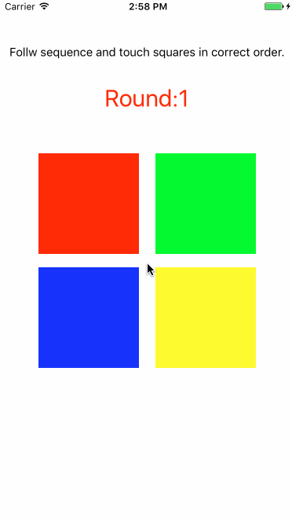

# MemoryOfSimon
This game is dedicated to [Simon](https://en.wikipedia.org/wiki/Simon_(game)).  
Code in swift.  
Thank to Mr Boisy.

# Display
Follow the sequence, then you need to touch these four suqares in correct order.  
The **highlight time** of squares and **round count** may affect difficulty of this game.  
Here we set **0.5 seconds** of highlight time and **3** round count. If you pass 3 rounds, you are won.
